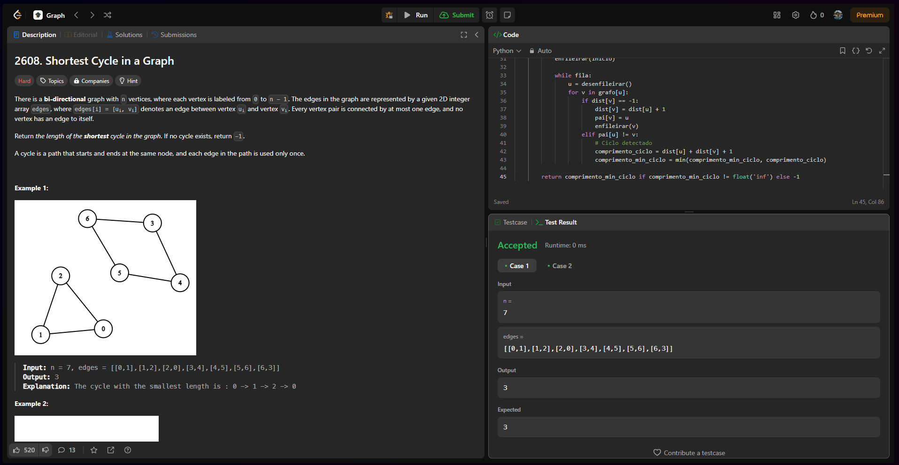
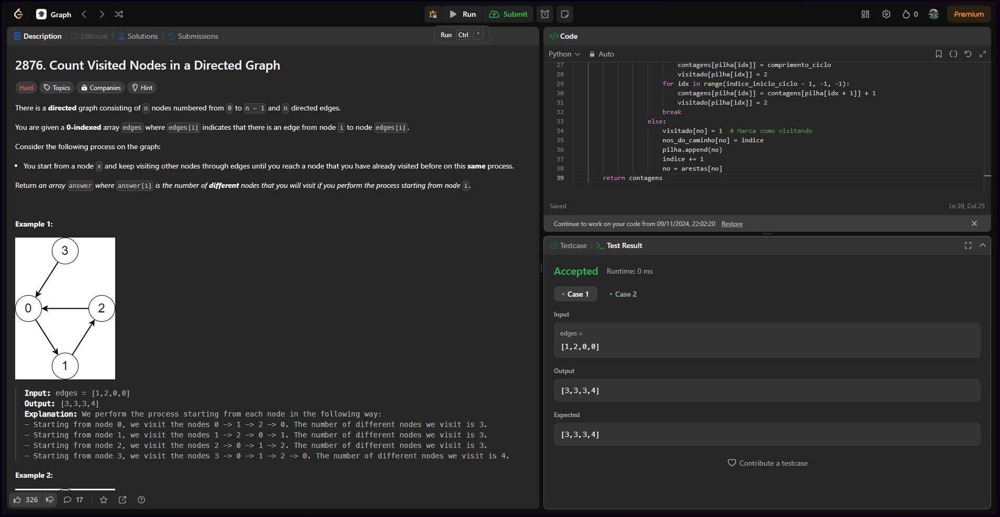

# Grafos1_DesafiosLeetCode

**Número da Lista**: Grafos 1 
**Conteúdo da Disciplina**: Grafos 1 

## Alunos

| Matrícula  | Aluno                          |
| ---------- | ------------------------------ |
| 22/1008051 | GABRIEL HENRIQUE CASTELO COSTA |
| 21/1030809 | JULIO CESAR ALMEIDA DOURADO    |

## Sobre

Nosso projeto foi resolução de problemas do LeetCode.

## Vídeo de apresentação
[Link para o vídeo de apresentação](https://youtu.be/XzEHqf3ENY0)

## Screenshots do Projeto em Funcionamento

Aqui estão algumas imagens do projeto em funcionamento:

#### Desafio 1 [785. Is Graph Bipartite? (MEDIUM)](https://leetcode.com/problems/is-graph-bipartite/description/?envType=problem-list-v2&envId=graph&difficulty=MEDIUM)

#### Desafio 2 [2608. Shortest Cycle in a Graph (HARD)](https://leetcode.com/problems/shortest-cycle-in-a-graph/description/?envType=problem-list-v2&envId=graph&difficulty=HARD)

#### Desafio 3 [2876. Count Visited Nodes in a Directed Graph(HARD)](https://leetcode.com/problems/count-visited-nodes-in-a-directed-graph/description/?envType=problem-list-v2&envId=graph&difficulty=HARD)

### Desafio 4 [913. Cat and Mouse(HARD)](https://leetcode.com/problems/cat-and-mouse/description/)

